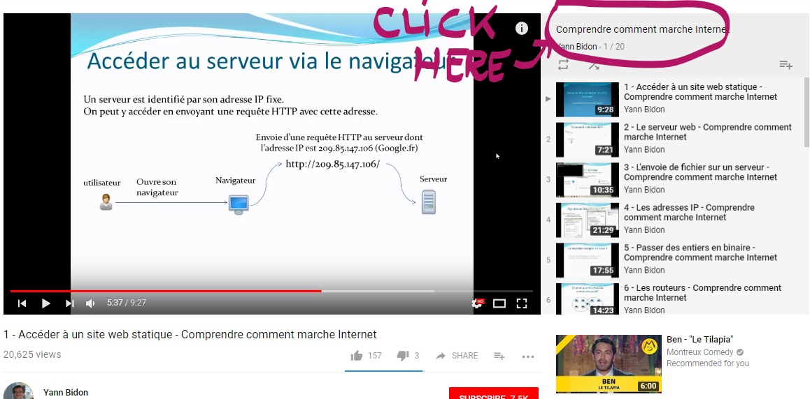
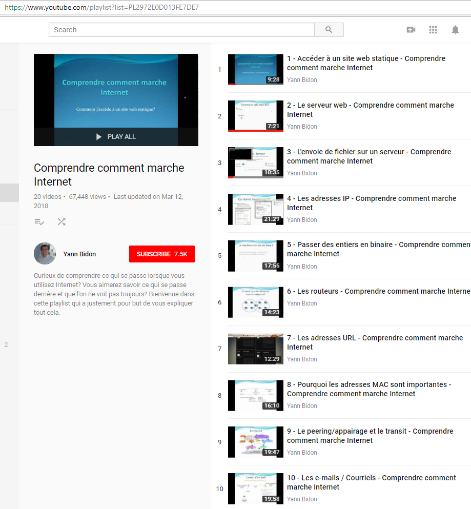
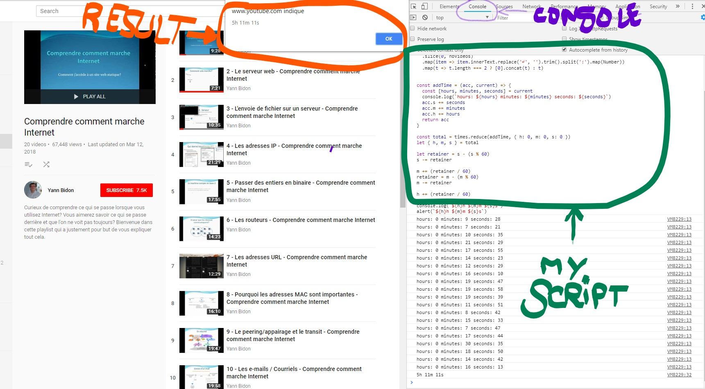

# YTPL-duration
a simple script to run in your browser console to get the total duration of a youtube playlist.

It's a usual problem for me, I want to know how long is a youtube playlist :grinning: !

Unfortunately, you cannot run it while you're watching the playlist. (*maybe I'll work on a version 2 but now I'm lazy...*)

## Steps
1. You must to click on the playlist name (*you'll be redirect to a page like this*)

2. Paste my code into the browser console

3. Type 'Enter' and get your result :smirk:

> Don't judge me, I was bored...
